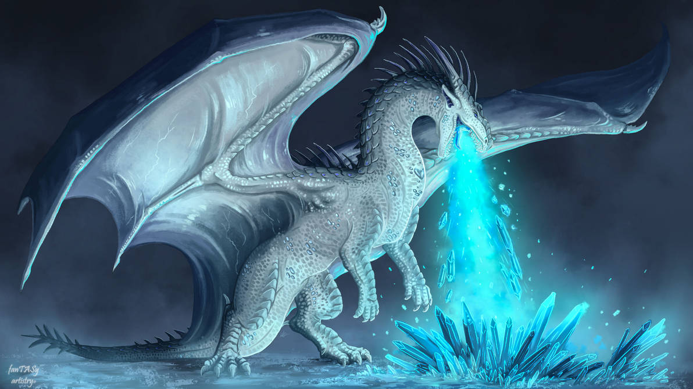
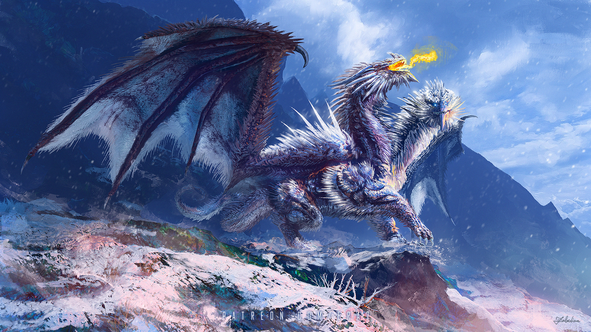
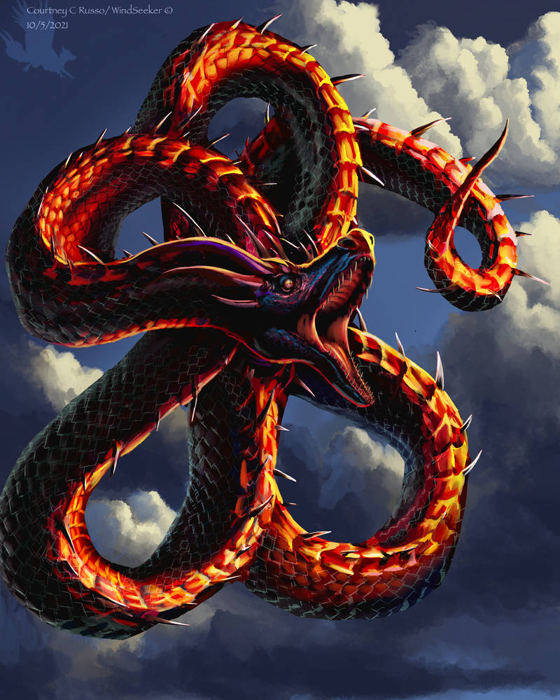

```{r warning = FALSE}
library(ape)
library(dplyr)
library(ggtree)
DragonsNexus <- c(read.nexus.data("input/DragonMatrix.nex"), read.nexus.data("input/A7_MAHRTSMITH_AMELIE_DragonAppend.nex")) #import original and appendment data into single list object 

WeightsDat <- read.csv("input/Weights.csv")  #import weighting data
WeightsVec <- paste0(WeightsDat$Weight, collapse = "") %>% strsplit(split = "") %>% unlist() #vector of weights
WeightsNum <- rep(NA, length(WeightsVec))  #empty vector for storing data
for (i in 1:length(WeightsVec)){
  if (WeightsVec[i] %in% c(0:9)) {
    WeightsNum[i] <- as.numeric(WeightsVec[i])  #keep numbers as-is
  } else {
    WeightsNum[i] <- as.numeric(which(LETTERS == WeightsVec[i]) + 9)  #replace letter weights with a corresponding number from 10-35
  }
} 

WtDragonNex <- DragonsNexus
for (i in 1:length(WtDragonNex)) {
  WtDragonNex[[i]] <- paste(as.numeric(WtDragonNex[[i]])*WeightsNum)  #multiply the binary values by the weighted values
}

WtDragonDF <- data.frame(matrix(unlist(WtDragonNex), ncol = length(WtDragonNex[[1]]), byrow = TRUE))  #convert to data frame
row.names(WtDragonDF) <- names(DragonsNexus)  #keep original row names
```

Use ggtree! review 'layouts' section (for quiz) 
and annotations section for this report probably
You can annotate the tips with dragon images 
https://guangchuangyu.github.io/ggtree-book/chapter-ggtree.html 




by fanTASyartistry on [DeviantArt](https://www.deviantart.com/fantasyartistry/art/Snowheart-Dragon-commission-907603851) 
(2022). 




by ERA7 on [DeviantArt](https://www.deviantart.com/era7/art/Steel-Dragon-Boss-907575223) (2022).




by Windseeker on [DeviantArt](https://www.deviantart.com/windseeker/art/Red-Serpent-893955932) (2021). 


```{r}
WtDragonDist <- dist(WtDragonDF, method = 'euclidean')
WtDragonTree <- fastme.bal(WtDragonDist)
WtDragonTree$tip.label <- gsub("([^X]+)X*", "\\1", WtDragonTree$tip.label)

tree2 <- groupClade(WtDragonTree, .node = c(91, 123))


pdf()
  ggtree(tree2, layout = 'circular', aes(colour = group)) + geom_text(aes(label=node), hjust=-.3, size = 1) + geom_tiplab(size = 1)
# + scale_colour_something(values = c("""""""))
dev.off()

images <- c("images/RedSerpent.jpg")

library(ggimage)
pdf()
  ggtree(tree2, layout = 'circular', aes(colour = group)) + geom_text(aes(label=node), hjust=-.3, size = 1) + geom_tiplab(size = 1) + geom_tiplab(aes(image = images), geom = "image") 
# + scale_colour_something(values = c("""""""))
dev.off()
```

 75 (node 41), 76 (node 7), and 77 (node 42) are your dragons.
76 and 77 split from node 123, which connects to the tree via 97->96->83->82->81
